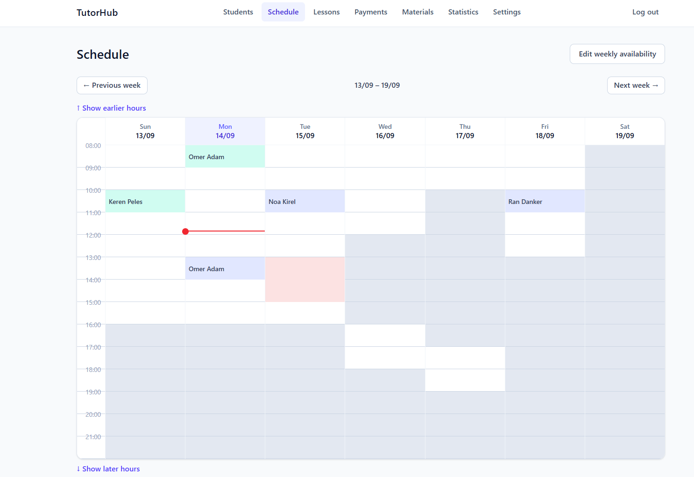
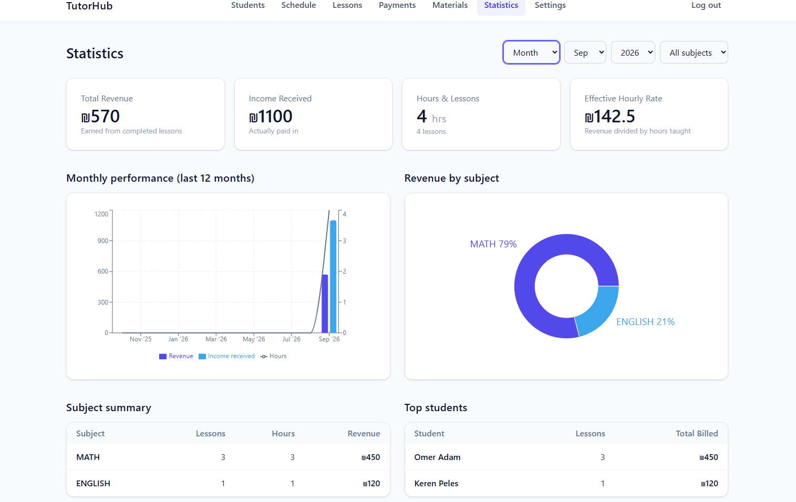

# TutorHub

A full-stack web app for a private tutor to manage students, lesson scheduling, payments, and study materials — built end-to-end as a portfolio project: REST API, relational schema, JWT auth, async messaging, and a React frontend.

**Stack:** Spring Boot 4 (Java 17) · PostgreSQL · Spring Security (JWT) · JMS (embedded ActiveMQ Artemis) · React 19 + TypeScript · Tailwind CSS · Vite


## Features

- **Auth** — JWT-based login with two roles (teacher / student). No public sign-up; only the teacher can create student accounts. Login attempts are rate-limited per email to block brute-force attempts.
- **Scheduling** — a weekly grid combining recurring availability rules with one-off overrides (block or open a specific slot). Either the teacher or the student can book a lesson; bookings are protected against double-booking with a database-level lock, not just an application-level check.
- **Lessons** — booking, editing, cancellation (with a minimum-notice window for students), and completion — the trigger that turns a lesson into billable debt. Each lesson snapshots its price at booking time, so a later rate change never rewrites history.
- **Payments** — the teacher records payments per student; outstanding debt is computed from completed lessons minus payments, viewable per-student or as a full list.
- **Study materials** — the teacher shares files, links, or notes with a student, optionally tied to a specific lesson. File uploads are stored as binary data in Postgres.
- **Statistics** — revenue, lesson volume, and debt overview for the teacher, with charts.
- **Email reminders** — an async job scans for upcoming lessons and emails students ahead of time, respecting quiet hours.





## Architecture

**Backend** follows a strict layered structure — `Controller → Service → Repository` — with one hard rule: a service never reaches into another domain's repository directly, it goes through that domain's service. A few packages break the "one folder per layer" pattern on purpose, because they're cross-cutting infrastructure rather than another feature slice:

- `security/` — JWT creation and validation, the request filter that populates the security context on every call, and a per-email login rate limiter.
- `jms/` — the async reminder pipeline: a scheduled producer that queues lesson IDs needing a reminder, and a listener that sends the email and marks it sent (only after a successful send, so a transient failure retries on the next scan instead of silently dropping).
- `exception/` — every domain error carries its own HTTP status, so a single `@RestControllerAdvice` handler maps all of them without a switch statement; framework-level exceptions (bad JSON, oversized uploads, auth failures, optimistic-lock conflicts) each get one explicit handler.
- `config/` — Spring wiring (security filter chain, CORS, initial teacher account seeding).

DTOs (Java records) are strictly separate from JPA entities — nothing entity-shaped crosses the controller boundary, and a couple of DTOs conditionally omit fields depending on who's asking (a student never sees a teacher's private lesson notes, for instance).

**Frontend** mirrors the same layering: pages are thin (layout only), hooks own state and talk to the API (the "service layer"), and components are pure presentation driven by props. A component lives in a feature subfolder only if it's used by exactly one page; anything reused across pages, or generic UI (modal shell, pager, nav), stays at the top level.

**Concurrency & data integrity**

- Two people booking the same slot at once is resolved with a Postgres advisory lock scoped to the transaction and keyed by date — not just an in-memory or optimistic check — so the database itself serializes the conflicting writes.
- `@Version` optimistic locking on lessons and payments returns a clean 409 instead of silently overwriting a concurrent edit.
- Lessons and payments are soft-deleted (status flag) to preserve history for statistics; materials are hard-deleted since there's nothing to retain.


## Running it locally

**Backend**

```bash
# 1. Create a Postgres database matching spring.datasource.url in
#    src/main/resources/application.properties
# 2. Copy .env.example to .env and fill in real values (DB credentials, JWT secret, mail credentials)
./mvnw spring-boot:run
```

Tables are created/updated automatically on startup (`ddl-auto=update`); a teacher account is seeded from the `.env` values on first run.

**Frontend**

```bash
cd frontend
npm install
npm run dev
```

Runs at `http://localhost:5173`, calling the backend at `http://localhost:8080`.
